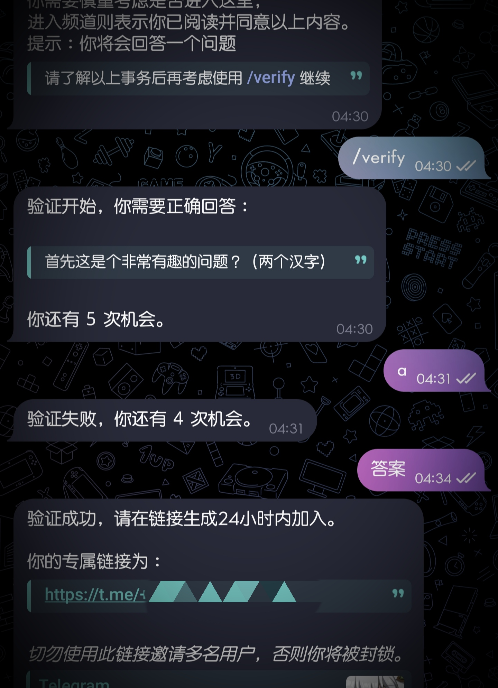

# Telegram-Simple-Verification-Bot
Telegram 简易验证机器人 - 检测文字回答问题进群。

*验证指定问题，只有正确回答，才能得到属于一个人的专属邀请链接。*



## 现有功能
- [x] 预先验证
- [x] 支持自定义问答
- [x] 支持多个答案
- [x] 每人下放单独的定制链接
- [x] 可自定义下放最大链接数量
- [x] 自定义黑名单 & 封禁提示
- [x] 记录回答
- [x] 记录消息到文件
- [ ] 自动备份

## 指令
```
/start - 在验证前所要给予给被验证者的一些提醒。
```
```
/verify - 被验证者将会有 5 次机会通过发送非命令消息进行验证。
```
```
/deleta {link} - 匹配指定用户名的发送者可以删除由机器人生成的链接。
```

## 适配环境
- Python == 3.11.0
  - Python-Telegram-Bot == 20.8

## 简易使用

### 第一步

01. 将此项目克隆至本地。
```
git clone https://github.com/ahalpha/Telegram-Simple-Verification-Bot.git
```
02. 定位到项目目录。
```
cd Telegram-Simple-Verification-Bot
```
03. 安装环境。
```
pip install -r requirements.txt
```

### 配置

编辑 `configs.py` 文件:
01. 你需要在你的 Telegram 中通过 `@BotFather` 来创建一个属于你的机器人，然后获取它的 `TOKEN` ，将其替换至 `token = "TOKEN"` 里的 `TOKEN` 中。
```
# 你的机器人 TOKEN
token = "TOKEN"
```
02. 获取你所要验证群聊的 `群聊ID` ，你可以选择通过邀请机器人 `@getmyid_bot` 来得到指定群聊的 `群聊ID` ，将其替换至 `group_id = -1000000000000` 里的 `-1000000000000` 中。
```
# 所验证群聊的ID
group_id = -1000000000000
# 你可以使用机器人 @getmyid_bot 获取群聊的ID
```
03. 配置机器人目前所能邀请的最大人数，如果达到上限，将不会再生成新的链接，在 `verified_max = 10`的 `10` 中配置一个整数。
```
# 链接申请最大数量
verified_max = 10
```
04. 你可以配置自己的 Telegram 用户名，以便在一些时候，使用 `/delete {link}` 来删除一些由机器人生成的链接。`
```
# 你的用户名
admin_username = "Aleph_Studio"
# 用于移除由机器人生成的邀请链接 (非必要)
# 用法 '/delete {链接}'
```
05. 是否记录消息，将会在项目根目录生成 `messages.log` 文件以记录机器人所收到的消息记录，将 `islogmessages = True` 里的 `True` 替换为 `False` 关闭 或 `True` 启用。
```
# 是否记录消息
islogmessages = True
```
06. 在开始验证前，被验证者输入 `/start` 时获得的提示，默认支持 Markdown 格式。
```
# 输入 /start 提示
rule = ( "*请注意你将会进入* `频道` *||__\(这个分区\)__||*"
+ "\n" + ""
+ "\n" + "||*频道* \- 主要包括你会进入这个频道。||"
+ "\n" + ""
+ "\n" + "||而__进入__：代表你同意这些规则。||"
+ "\n" + ""
+ "\n" + "同意这条规则 XXXXXXXXX ，"
+ "\n" + "同意这些规则 XXXXXXXXX ，"
+ "\n" + "同意所有规则 XXXXXXXXX 。"
+ "\n" + ""
+ "\n" + "*而你，我的朋友。*"
+ "\n" + ""
+ "\n" + "你需要慎重考虑是否进入这里，"
+ "\n" + "进入频道则表示你已阅读并同意以上内容。"
+ "\n" + "提示：你将会回答一个问题"
+ "\n" + "> ||*请了解以上事务后再考虑使用 /verify 继续*||"
)
```
07. 现在，你需要设置一个让被验证者回答的问题，替换 `lock = "首先这是个非常有趣的问题？（两个汉字）"` 中的 `首先这是个非常有趣的问题？（两个汉字）` 为你要为这里设置验证的问题。
```
# 问题
lock = "首先这是个非常有趣的问题？（两个汉字）"
```
08. 设置一个或多个答案，如果仅需一个答案，则将 `[ "有趣", "答案" ]` 参考替换为 `[ "答案" ]` ，如果你需要增加更多答案，如 4 个则替换为 `[ "答案A", "答案B", "答案C", "答案D" ]` 等以此类推。
```
# 答案
key = [ "有趣", "答案" ] # [ "答案A", "答案B", ... ]
```

### 运行
在项目目录下使用命令来运行这个机器人。成功运行后，控制台不会有任何提示。
```
python main.py
```
你可以对机器人发送 `/start` 来检查是否运行成功。

### 配置黑名单
示例：
```
{
    "100000000":{
        "id":1,
        "username":"Aleph_Studio",
        "first_name":"AhAlpha",
        "last_name":null,
        "verify_num":4,
        "k":{
            "1":"a"
        },
[*]     "verified":true,
[+]     "isban":"封禁原因"
    }
}
```

## 数据结构
```
{
    "verified_num":0, // 通过验证总数
    "fail_num":0, // 失败验证总数
    "100000000":{ // 被验证者标识
        "id":1, // 被验证者序号
        "username":"Aleph_Studio", // 被验证者名称
        "first_name":"AhAlpha",
        "last_name":null,
        "verify_num":3, // 剩余可验证次数
        "k":{ // 错误回答
            "1":"a",
            "2":"b"
        },
        "verified":true, // 是否通过验证
        "link":"https://t.me/+...", // 专属链接
        "isban":"" // 被禁止
    }
}
```

## 有关于更多配置参考

[**Telegram-Markdown-Html-Deeplink-Guide**](https://github.com/dingdangcats/Telegram-Markdown-Html-Deeplink-Guide)

[**python-telegram-bot**](https://docs.python-telegram-bot.org/)

